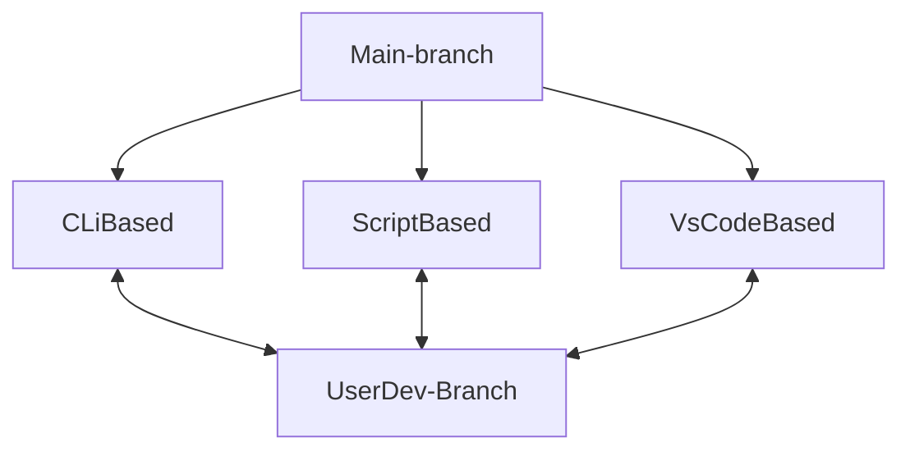

# wagono-sdk-docker
Build firmware for Wago devices

Clone this repository
```
git clone https://github.com/Wago-Norge/wagono-sdk-docker.git
```

Build image
```
cd wago-sdk-docker
docker build -t wagono-sdk-docker:latest .
```

Run container based on built image
```
docker run -d --name wago-sdk-builder wagono-sdk-docker
```

Connect to shell inside the container
```
docker exec -it wago-sdk-builder sh
```

Clone source and config repository
```
git clone https://github.com/Wago-Norge/wagono-ptxdist-config-cc100.git
cd wagono-ptxdist-config-cc100
git submodule update --init
```

## TEST 




