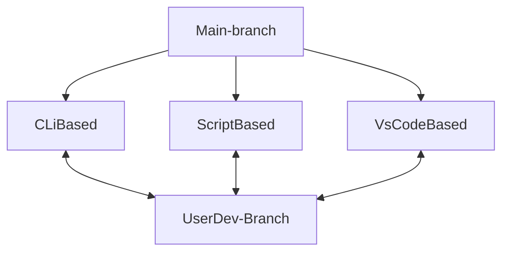

# wagono-sdk-docker
Build firmware for Wago devices

## TEST 

```mermaid 
graph TD;

    %% FLOW GENERAL:
        Main-branch-->CLiBased;
        Main-branch-->ScriptBased;
        Main-branch-->VsCodeBased;
  
      
        CLiBased<-->UserDev-Branch;
        ScriptBased<-->UserDev-Branch;
        VsCodeBased<-->UserDev-Branch;
```

